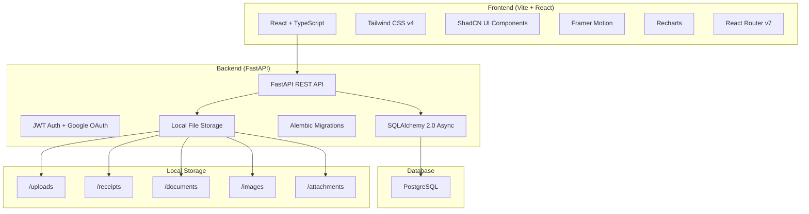

# LifeOS — Personal Life Operating System

A premium, enterprise-grade personal operating system to manage finances, goals, dreams, projects, knowledge, and every aspect of life from one centralized platform.

---

## User Review Required

> [!IMPORTANT]
> **Tech Stack Conflict — Prisma vs Python Backend**
> You specified **Prisma** as the ORM, but Prisma is a Node.js/TypeScript ORM and is **not compatible with a Python backend**. Since you also specified **Python** as the backend language, I will use **SQLAlchemy 2.0** (async) with **Alembic** for migrations instead. This is the gold-standard ORM for Python and provides the same schema-as-code experience as Prisma. If you'd prefer a Node.js backend (Express/Fastify) to use Prisma, let me know.

> [!IMPORTANT]
> **Phased Delivery Approach**
> This is a massive application (~50+ pages, 30+ database tables, 8 modules). Building everything at production quality in one pass is unrealistic. I propose building in **3 phases**:
> - **Phase 1 (Core)**: Auth, Dashboard (Life Command Center), Financial OS (expenses, income, net worth), basic UI shell
> - **Phase 2 (Life Management)**: Goals & Projects, Life Timeline, Dream Warehouse, Journal
> - **Phase 3 (Intelligence)**: Second Brain, Analytics, Financial Goal, Ideas Vault, advanced charts & exports
>
> Each phase will be fully functional and polished. **I'll start with Phase 1 and deliver a working app before proceeding.**

> [!WARNING]
> **Google OAuth** requires a Google Cloud project with OAuth credentials configured. I'll build the plumbing for it, but you'll need to supply your own `GOOGLE_CLIENT_ID` and `GOOGLE_CLIENT_SECRET` via environment variables. The login will be restricted to your approved Gmail only.

---

## Open Questions

> [!IMPORTANT]
> **Currency**: You use ₹ (INR) in your examples. Should the app default to INR, or should it support a configurable currency?

> [!IMPORTANT]  
> **PostgreSQL Setup**: Do you already have PostgreSQL installed locally, or should I include Docker Compose setup for the database?

> [!IMPORTANT]
> **Port Preferences**: Any preference for the frontend dev server port (default: 5173) and backend API port (default: 8000)?

---

## Architecture Overview



---

## Tech Stack (Final)

| Layer | Technology | Version |
|-------|-----------|---------|
| **Frontend Framework** | React | 19+ |
| **Build Tool** | Vite | 6+ |
| **Language** | TypeScript | 5.x |
| **Styling** | Tailwind CSS | v4 (`@tailwindcss/vite` plugin) |
| **Component Library** | ShadCN UI | Latest |
| **Animations** | Framer Motion | 12+ |
| **Charts** | Recharts | 2.x |
| **Routing** | React Router | v7 |
| **State Management** | React Context + Zustand | Latest |
| **Backend** | FastAPI | 0.115+ |
| **ORM** | SQLAlchemy 2.0 (async) | 2.0+ |
| **Migrations** | Alembic | Latest |
| **Database** | PostgreSQL | 16+ |
| **Auth** | JWT (python-jose) + OAuth2 | - |
| **File Storage** | Local filesystem | - |
| **Password Hashing** | passlib[bcrypt] | - |

---

## Database Schema

### Core Tables

```
┌─────────────────────────────────────────────┐
│ users                                        │
├─────────────────────────────────────────────┤
│ id (UUID, PK)                                │
│ email (VARCHAR, UNIQUE)                      │
│ hashed_password (VARCHAR, NULLABLE)          │
│ name (VARCHAR)                               │
│ avatar_url (VARCHAR, NULLABLE)               │
│ google_id (VARCHAR, NULLABLE)                │
│ is_active (BOOLEAN, DEFAULT true)            │
│ is_approved (BOOLEAN, DEFAULT false)         │
│ created_at (TIMESTAMPTZ)                     │
│ updated_at (TIMESTAMPTZ)                     │
└─────────────────────────────────────────────┘
```

### Financial Module Tables

```
┌──────────────────────────────┐    ┌──────────────────────────────┐
│ expense_categories           │    │ expenses                     │
├──────────────────────────────┤    ├──────────────────────────────┤
│ id (UUID, PK)                │    │ id (UUID, PK)                │
│ name (VARCHAR)               │◄───│ category_id (UUID, FK)       │
│ icon (VARCHAR)               │    │ amount (DECIMAL)             │
│ color (VARCHAR)              │    │ description (TEXT)           │
│ user_id (UUID, FK)           │    │ date (DATE)                  │
│ created_at (TIMESTAMPTZ)     │    │ is_recurring (BOOLEAN)       │
└──────────────────────────────┘    │ recurrence_pattern (VARCHAR) │
                                    │ receipt_url (VARCHAR)        │
                                    │ notes (TEXT)                 │
                                    │ user_id (UUID, FK)           │
                                    │ created_at (TIMESTAMPTZ)     │
                                    │ updated_at (TIMESTAMPTZ)     │
                                    └──────────────────────────────┘

┌──────────────────────────────┐    ┌──────────────────────────────┐
│ incomes                      │    │ debts                        │
├──────────────────────────────┤    ├──────────────────────────────┤
│ id (UUID, PK)                │    │ id (UUID, PK)                │
│ source (VARCHAR)             │    │ name (VARCHAR)               │
│ amount (DECIMAL)             │    │ type (ENUM)                  │
│ date (DATE)                  │    │ principal (DECIMAL)          │
│ category (VARCHAR)           │    │ interest_rate (DECIMAL)      │
│ is_recurring (BOOLEAN)       │    │ current_balance (DECIMAL)    │
│ notes (TEXT)                 │    │ monthly_payment (DECIMAL)    │
│ user_id (UUID, FK)           │    │ due_date (DATE)              │
│ created_at (TIMESTAMPTZ)     │    │ lent_to (VARCHAR, NULLABLE)  │
│ updated_at (TIMESTAMPTZ)     │    │ borrowed_from (VARCHAR)      │
└──────────────────────────────┘    │ status (ENUM)                │
                                    │ user_id (UUID, FK)           │
                                    │ created_at (TIMESTAMPTZ)     │
                                    │ updated_at (TIMESTAMPTZ)     │
                                    └──────────────────────────────┘

┌──────────────────────────────┐    ┌──────────────────────────────┐
│ investments                  │    │ financial_goals              │
├──────────────────────────────┤    ├──────────────────────────────┤
│ id (UUID, PK)                │    │ id (UUID, PK)                │
│ name (VARCHAR)               │    │ name (VARCHAR)               │
│ type (ENUM)                  │    │ target_amount (DECIMAL)      │
│ invested_amount (DECIMAL)    │    │ current_amount (DECIMAL)     │
│ current_value (DECIMAL)      │    │ deadline (DATE)              │
│ platform (VARCHAR)           │    │ icon (VARCHAR)               │
│ notes (TEXT)                 │    │ color (VARCHAR)              │
│ date_invested (DATE)         │    │ notes (TEXT)                 │
│ user_id (UUID, FK)           │    │ user_id (UUID, FK)           │
│ created_at (TIMESTAMPTZ)     │    │ created_at (TIMESTAMPTZ)     │
│ updated_at (TIMESTAMPTZ)     │    │ updated_at (TIMESTAMPTZ)     │
└──────────────────────────────┘    └──────────────────────────────┘

┌──────────────────────────────┐    ┌──────────────────────────────┐
│ debt_payments                │    │ expense_tags                 │
├──────────────────────────────┤    ├──────────────────────────────┤
│ id (UUID, PK)                │    │ id (UUID, PK)                │
│ debt_id (UUID, FK)           │    │ name (VARCHAR)               │
│ amount (DECIMAL)             │    │ user_id (UUID, FK)           │
│ date (DATE)                  │    └──────────────────────────────┘
│ notes (TEXT)                 │
│ created_at (TIMESTAMPTZ)     │    ┌──────────────────────────────┐
└──────────────────────────────┘    │ expense_tag_map (join table) │
                                    ├──────────────────────────────┤
                                    │ expense_id (UUID, FK)        │
                                    │ tag_id (UUID, FK)            │
                                    └──────────────────────────────┘

┌──────────────────────────────┐
│ financial_ideas              │
├──────────────────────────────┤
│ id (UUID, PK)                │
│ title (VARCHAR)              │
│ description (TEXT)           │
│ category (VARCHAR)           │
│ status (ENUM)                │
│ priority (ENUM)              │
│ notes (TEXT)                 │
│ user_id (UUID, FK)           │
│ created_at (TIMESTAMPTZ)     │
│ updated_at (TIMESTAMPTZ)     │
└──────────────────────────────┘
```

### Life Management Tables

```
┌──────────────────────────────┐    ┌──────────────────────────────┐
│ life_goals (Timeline)        │    │ dreams                       │
├──────────────────────────────┤    ├──────────────────────────────┤
│ id (UUID, PK)                │    │ id (UUID, PK)                │
│ title (VARCHAR)              │    │ title (VARCHAR)              │
│ description (TEXT)           │    │ description (TEXT)           │
│ horizon (ENUM: 1Y/3Y/5Y/10Y)│    │ category (VARCHAR)           │
│ target_year (INT)            │    │ estimated_cost (DECIMAL)     │
│ progress (INT, 0-100)        │    │ priority (ENUM)              │
│ status (ENUM)                │    │ target_date (DATE)           │
│ order (INT)                  │    │ progress (INT, 0-100)        │
│ user_id (UUID, FK)           │    │ notes (TEXT)                 │
│ created_at (TIMESTAMPTZ)     │    │ user_id (UUID, FK)           │
│ updated_at (TIMESTAMPTZ)     │    │ created_at (TIMESTAMPTZ)     │
└──────────────────────────────┘    │ updated_at (TIMESTAMPTZ)     │
                                    └──────────────────────────────┘

┌──────────────────────────────┐    ┌──────────────────────────────┐
│ projects (Goals)             │    │ milestones                   │
├──────────────────────────────┤    ├──────────────────────────────┤
│ id (UUID, PK)                │    │ id (UUID, PK)                │
│ title (VARCHAR)              │    │ title (VARCHAR)              │
│ description (TEXT)           │    │ project_id (UUID, FK)        │
│ priority (ENUM)              │    │ due_date (DATE)              │
│ status (ENUM)                │    │ status (ENUM)                │
│ due_date (DATE)              │    │ order (INT)                  │
│ progress (INT, 0-100)        │    │ created_at (TIMESTAMPTZ)     │
│ color (VARCHAR)              │    │ updated_at (TIMESTAMPTZ)     │
│ icon (VARCHAR)               │    └──────────────────────────────┘
│ user_id (UUID, FK)           │
│ created_at (TIMESTAMPTZ)     │    ┌──────────────────────────────┐
│ updated_at (TIMESTAMPTZ)     │    │ tasks                        │
└──────────────────────────────┘    ├──────────────────────────────┤
                                    │ id (UUID, PK)                │
                                    │ title (VARCHAR)              │
                                    │ description (TEXT)           │
                                    │ milestone_id (UUID, FK)      │
                                    │ project_id (UUID, FK)        │
                                    │ parent_task_id (UUID, FK)    │
                                    │ priority (ENUM)              │
                                    │ status (ENUM)                │
                                    │ due_date (DATE)              │
                                    │ time_estimate_mins (INT)     │
                                    │ order (INT)                  │
                                    │ user_id (UUID, FK)           │
                                    │ created_at (TIMESTAMPTZ)     │
                                    │ updated_at (TIMESTAMPTZ)     │
                                    └──────────────────────────────┘
```

### Knowledge & Journal Tables

```
┌──────────────────────────────┐    ┌──────────────────────────────┐
│ notes (Second Brain)         │    │ journal_entries              │
├──────────────────────────────┤    ├──────────────────────────────┤
│ id (UUID, PK)                │    │ id (UUID, PK)                │
│ title (VARCHAR)              │    │ date (DATE, UNIQUE)          │
│ content (TEXT — rich text)   │    │ thoughts (TEXT)              │
│ category (VARCHAR)           │    │ wins (TEXT)                  │
│ is_favorite (BOOLEAN)        │    │ lessons (TEXT)               │
│ user_id (UUID, FK)           │    │ failures (TEXT)              │
│ created_at (TIMESTAMPTZ)     │    │ gratitude (TEXT)             │
│ updated_at (TIMESTAMPTZ)     │    │ mood (ENUM)                 │
└──────────────────────────────┘    │ energy_level (INT, 1-10)     │
                                    │ user_id (UUID, FK)           │
┌──────────────────────────────┐    │ created_at (TIMESTAMPTZ)     │
│ note_tags (join table)       │    │ updated_at (TIMESTAMPTZ)     │
├──────────────────────────────┤    └──────────────────────────────┘
│ note_id (UUID, FK)           │
│ tag_id (UUID, FK)            │    ┌──────────────────────────────┐
└──────────────────────────────┘    │ tags (universal)             │
                                    ├──────────────────────────────┤
┌──────────────────────────────┐    │ id (UUID, PK)                │
│ note_backlinks               │    │ name (VARCHAR)               │
├──────────────────────────────┤    │ color (VARCHAR)              │
│ source_note_id (UUID, FK)    │    │ user_id (UUID, FK)           │
│ target_note_id (UUID, FK)    │    │ created_at (TIMESTAMPTZ)     │
└──────────────────────────────┘    └──────────────────────────────┘

┌──────────────────────────────┐
│ attachments (universal)      │
├──────────────────────────────┤
│ id (UUID, PK)                │
│ filename (VARCHAR)           │
│ file_path (VARCHAR)          │
│ file_type (VARCHAR)          │
│ file_size (BIGINT)           │
│ entity_type (VARCHAR)        │
│ entity_id (UUID)             │
│ user_id (UUID, FK)           │
│ created_at (TIMESTAMPTZ)     │
└──────────────────────────────┘

┌──────────────────────────────┐
│ dream_images                 │
├──────────────────────────────┤
│ id (UUID, PK)                │
│ dream_id (UUID, FK)          │
│ image_url (VARCHAR)          │
│ caption (VARCHAR)            │
│ order (INT)                  │
│ created_at (TIMESTAMPTZ)     │
└──────────────────────────────┘
```

**Total: ~25 tables** covering all 8 modules.

---

## Folder Structure

```
e:\Web Development\Personal\LifeOS\
├── frontend/                          # React + Vite application
│   ├── public/
│   │   └── favicon.svg
│   ├── src/
│   │   ├── assets/                    # Static assets (icons, images)
│   │   ├── components/
│   │   │   ├── ui/                    # ShadCN UI components
│   │   │   ├── layout/               # AppShell, Sidebar, Topbar, MobileNav
│   │   │   ├── dashboard/            # Dashboard widgets & cards
│   │   │   ├── finance/              # Finance-specific components
│   │   │   ├── goals/                # Goal & project components
│   │   │   ├── timeline/             # Life timeline components
│   │   │   ├── dreams/               # Dream warehouse components
│   │   │   ├── brain/                # Second brain components
│   │   │   ├── journal/              # Journal components
│   │   │   ├── analytics/            # Chart & analytics components
│   │   │   └── shared/               # Shared/common components
│   │   ├── contexts/                  # React contexts (Auth, Theme)
│   │   ├── hooks/                     # Custom React hooks
│   │   ├── lib/                       # Utility functions, API client
│   │   ├── pages/                     # Route pages
│   │   │   ├── auth/                  # Login page
│   │   │   ├── dashboard/            # Home / Life Command Center
│   │   │   ├── finance/              # All finance sub-pages
│   │   │   │   ├── expenses/
│   │   │   │   ├── income/
│   │   │   │   ├── debts/
│   │   │   │   ├── investments/
│   │   │   │   ├── net-worth/
│   │   │   │   ├── goals/
│   │   │   │   └── ideas/
│   │   │   ├── timeline/
│   │   │   ├── dreams/
│   │   │   ├── goals/
│   │   │   ├── brain/
│   │   │   ├── journal/
│   │   │   └── analytics/
│   │   ├── store/                     # Zustand stores
│   │   ├── types/                     # TypeScript type definitions
│   │   ├── App.tsx                    # Root component + Router
│   │   ├── main.tsx                   # Entry point
│   │   └── index.css                  # Tailwind + global styles
│   ├── components.json               # ShadCN config
│   ├── tsconfig.json
│   ├── vite.config.ts
│   └── package.json
│
├── backend/                           # FastAPI application
│   ├── app/
│   │   ├── api/
│   │   │   ├── v1/
│   │   │   │   ├── auth.py
│   │   │   │   ├── expenses.py
│   │   │   │   ├── incomes.py
│   │   │   │   ├── debts.py
│   │   │   │   ├── investments.py
│   │   │   │   ├── financial_goals.py
│   │   │   │   ├── financial_ideas.py
│   │   │   │   ├── life_goals.py
│   │   │   │   ├── dreams.py
│   │   │   │   ├── projects.py
│   │   │   │   ├── tasks.py
│   │   │   │   ├── notes.py
│   │   │   │   ├── journal.py
│   │   │   │   ├── analytics.py
│   │   │   │   ├── uploads.py
│   │   │   │   └── dashboard.py
│   │   │   └── deps.py               # Shared dependencies
│   │   ├── core/
│   │   │   ├── config.py             # Settings (pydantic-settings)
│   │   │   ├── database.py           # Async engine & session
│   │   │   └── security.py           # JWT, hashing, OAuth
│   │   ├── models/                    # SQLAlchemy models
│   │   │   ├── user.py
│   │   │   ├── finance.py
│   │   │   ├── goals.py
│   │   │   ├── dreams.py
│   │   │   ├── notes.py
│   │   │   ├── journal.py
│   │   │   └── attachments.py
│   │   ├── schemas/                   # Pydantic request/response schemas
│   │   │   ├── auth.py
│   │   │   ├── finance.py
│   │   │   ├── goals.py
│   │   │   ├── dreams.py
│   │   │   ├── notes.py
│   │   │   ├── journal.py
│   │   │   └── dashboard.py
│   │   └── main.py                    # App entry + lifespan
│   ├── migrations/                    # Alembic
│   │   ├── versions/
│   │   ├── env.py
│   │   └── alembic.ini
│   ├── uploads/                       # Local file storage
│   │   ├── receipts/
│   │   ├── documents/
│   │   ├── dreams/
│   │   ├── images/
│   │   └── attachments/
│   ├── requirements.txt
│   ├── .env                           # Environment variables
│   └── .env.example
│
├── docker-compose.yml                 # PostgreSQL + optional services
├── .gitignore
└── README.md
```

---

## API Design

### Authentication
| Method | Endpoint | Description |
|--------|---------|-------------|
| POST | `/api/v1/auth/register` | Initial admin setup (one-time) |
| POST | `/api/v1/auth/login` | Email + password login |
| POST | `/api/v1/auth/google` | Google OAuth login |
| GET | `/api/v1/auth/me` | Get current user profile |
| PUT | `/api/v1/auth/me` | Update profile |

### Expenses
| Method | Endpoint | Description |
|--------|---------|-------------|
| GET | `/api/v1/expenses` | List (with filters, search, pagination) |
| POST | `/api/v1/expenses` | Create expense |
| GET | `/api/v1/expenses/{id}` | Get single expense |
| PUT | `/api/v1/expenses/{id}` | Update expense |
| DELETE | `/api/v1/expenses/{id}` | Delete expense |
| GET | `/api/v1/expenses/analytics` | Expense analytics |

### Income
| Method | Endpoint | Description |
|--------|---------|-------------|
| GET | `/api/v1/incomes` | List incomes |
| POST | `/api/v1/incomes` | Create income |
| PUT | `/api/v1/incomes/{id}` | Update income |
| DELETE | `/api/v1/incomes/{id}` | Delete income |
| GET | `/api/v1/incomes/analytics` | Income analytics |

### Debts
| Method | Endpoint | Description |
|--------|---------|-------------|
| GET | `/api/v1/debts` | List debts |
| POST | `/api/v1/debts` | Create debt |
| PUT | `/api/v1/debts/{id}` | Update debt |
| DELETE | `/api/v1/debts/{id}` | Delete debt |
| POST | `/api/v1/debts/{id}/payments` | Record payment |
| GET | `/api/v1/debts/{id}/payments` | Payment history |

### Investments
| Method | Endpoint | Description |
|--------|---------|-------------|
| GET | `/api/v1/investments` | List investments |
| POST | `/api/v1/investments` | Create investment |
| PUT | `/api/v1/investments/{id}` | Update investment |
| DELETE | `/api/v1/investments/{id}` | Delete investment |
| GET | `/api/v1/investments/portfolio` | Portfolio summary |

### Financial Goals
| Method | Endpoint | Description |
|--------|---------|-------------|
| GET | `/api/v1/financial-goals` | List goals |
| POST | `/api/v1/financial-goals` | Create goal |
| PUT | `/api/v1/financial-goals/{id}` | Update goal |
| DELETE | `/api/v1/financial-goals/{id}` | Delete goal |

### Financial Ideas
| Method | Endpoint | Description |
|--------|---------|-------------|
| CRUD | `/api/v1/financial-ideas` | Standard CRUD |

### Life Timeline
| Method | Endpoint | Description |
|--------|---------|-------------|
| CRUD | `/api/v1/life-goals` | Standard CRUD |

### Dreams
| Method | Endpoint | Description |
|--------|---------|-------------|
| CRUD | `/api/v1/dreams` | Standard CRUD |
| POST | `/api/v1/dreams/{id}/images` | Upload dream images |

### Projects & Tasks
| Method | Endpoint | Description |
|--------|---------|-------------|
| CRUD | `/api/v1/projects` | Standard CRUD |
| CRUD | `/api/v1/projects/{id}/milestones` | Milestone CRUD |
| CRUD | `/api/v1/tasks` | Task CRUD (with subtask support) |

### Notes (Second Brain)
| Method | Endpoint | Description |
|--------|---------|-------------|
| CRUD | `/api/v1/notes` | Standard CRUD |
| GET | `/api/v1/notes/search` | Full-text search |
| GET | `/api/v1/notes/{id}/backlinks` | Get backlinks |

### Journal
| Method | Endpoint | Description |
|--------|---------|-------------|
| GET | `/api/v1/journal` | List entries |
| GET | `/api/v1/journal/{date}` | Get by date |
| POST | `/api/v1/journal` | Create entry |
| PUT | `/api/v1/journal/{id}` | Update entry |

### Dashboard
| Method | Endpoint | Description |
|--------|---------|-------------|
| GET | `/api/v1/dashboard` | Aggregated dashboard data |

### Analytics
| Method | Endpoint | Description |
|--------|---------|-------------|
| GET | `/api/v1/analytics/finance` | Financial analytics |
| GET | `/api/v1/analytics/goals` | Goal analytics |
| GET | `/api/v1/analytics/life` | Life progress analytics |

### File Uploads
| Method | Endpoint | Description |
|--------|---------|-------------|
| POST | `/api/v1/uploads` | Upload file |
| GET | `/api/v1/uploads/{filename}` | Serve file |
| DELETE | `/api/v1/uploads/{id}` | Delete file |

---

## UI Design System

### Color Palette (Dark Mode Primary)

| Token | Value | Usage |
|-------|-------|-------|
| `--bg-primary` | `hsl(222, 47%, 6%)` | App background |
| `--bg-secondary` | `hsl(222, 40%, 9%)` | Card backgrounds |
| `--bg-tertiary` | `hsl(222, 35%, 12%)` | Elevated surfaces |
| `--border` | `hsl(222, 20%, 16%)` | Borders |
| `--text-primary` | `hsl(210, 40%, 96%)` | Primary text |
| `--text-secondary` | `hsl(215, 20%, 65%)` | Secondary text |
| `--accent-emerald` | `hsl(160, 84%, 39%)` | Positive/Income/Growth |
| `--accent-rose` | `hsl(347, 77%, 50%)` | Negative/Expense/Debt |
| `--accent-violet` | `hsl(263, 70%, 50%)` | Primary actions |
| `--accent-amber` | `hsl(38, 92%, 50%)` | Warnings/Pending |
| `--accent-cyan` | `hsl(192, 91%, 36%)` | Info/Links |

### Typography
- **Font**: Inter (Google Fonts) — clean, modern, variable weight
- **Headings**: Inter Bold (600-700)
- **Body**: Inter Regular (400)
- **Mono**: JetBrains Mono — for financial figures

### Design Principles
1. **Glassmorphism cards** with subtle backdrop blur
2. **Gradient accents** on key metrics and CTA elements
3. **Micro-animations** on hover, page transitions, and data updates
4. **Consistent 8px grid system**
5. **Responsive breakpoints**: 640px (mobile), 768px (tablet), 1024px (desktop), 1280px (wide)

---

## Proposed Changes

### Phase 1: Core Foundation (Building Now)

---

#### Frontend Setup & Shell

##### [NEW] [LifeOS](file:///e:/Web Development/Personal/LifeOS)
Initialize Vite + React + TypeScript project, install Tailwind v4, ShadCN UI, Framer Motion, Recharts, React Router v7, Zustand, and all dependencies.

##### [NEW] [index.css](file:///e:/Web Development/Personal/LifeOS/frontend/src/index.css)
Design system tokens, global styles, Tailwind theme configuration, custom utility classes, glassmorphism mixins, animation keyframes.

##### [NEW] [App.tsx](file:///e:/Web Development/Personal/LifeOS/frontend/src/App.tsx)
Root component with React Router setup, theme provider, auth context, protected route wrapper.

##### [NEW] Layout Components
- `Sidebar.tsx` — Collapsible sidebar with module navigation, icons, active state indicators
- `Topbar.tsx` — Top navigation with search, notifications, user menu, theme toggle
- `AppShell.tsx` — Main layout wrapper combining sidebar + topbar + content area
- `MobileNav.tsx` — Bottom navigation for mobile devices

##### [NEW] Auth Pages
- `LoginPage.tsx` — Premium login page with email/password + Google OAuth button
- `AuthContext.tsx` — JWT token management, auth state, login/logout methods

---

#### Dashboard (Life Command Center)

##### [NEW] [DashboardPage.tsx](file:///e:/Web Development/Personal/LifeOS/frontend/src/pages/dashboard/DashboardPage.tsx)
The hero page of the app. Responsive grid layout with:
- **Net Worth Card** — Large hero metric with sparkline chart
- **Monthly Savings Card** — Income vs Expenses with trend indicator
- **Financial Health Score** — Circular gauge (0-100)
- **Active Goals Widget** — Top 5 goals with progress bars
- **Upcoming Tasks Widget** — Next 7 days of tasks
- **Dream Progress Widget** — Visual dream tracker
- **Life Timeline Widget** — Compact timeline preview
- **Recent Journal Widget** — Last 3 journal entries
- **Motivation Widget** — Daily motivational quote

---

#### Financial OS Module

##### [NEW] Finance Pages
- `ExpensesPage.tsx` — Full expense management with table, filters, search, add/edit modal
- `IncomePage.tsx` — Income tracking with source breakdown
- `DebtsPage.tsx` — Debt management with payment tracker
- `InvestmentsPage.tsx` — Portfolio view with allocation charts
- `NetWorthPage.tsx` — Net worth dashboard with historical chart
- `FinancialGoalsPage.tsx` — Financial goal tracker with progress rings
- `FinancialIdeasPage.tsx` — Ideas vault with kanban-style board

---

#### Backend API

##### [NEW] [main.py](file:///e:/Web Development/Personal/LifeOS/backend/app/main.py)
FastAPI application with CORS, lifespan events, router registration, static file serving.

##### [NEW] Core modules
- `config.py` — Environment-based settings via pydantic-settings
- `database.py` — Async SQLAlchemy engine, session factory, base model
- `security.py` — JWT creation/validation, password hashing, Google OAuth verification

##### [NEW] SQLAlchemy Models
All database models using SQLAlchemy 2.0 `Mapped`/`mapped_column` syntax with proper relationships.

##### [NEW] Pydantic Schemas
Request/response validation schemas for all endpoints.

##### [NEW] API Routes
All v1 API endpoint handlers for auth, expenses, income, debts, investments, goals, dashboard aggregation.

##### [NEW] Alembic Migrations
Initial migration creating all Phase 1 tables.

---

### Phase 2: Life Management (After Phase 1 approval)

- Life Timeline interactive visualization
- Dream Warehouse with image gallery
- Goal & Project Command Center (List, Kanban, Timeline, Calendar views)
- Journal System with calendar navigation

### Phase 3: Intelligence Layer (After Phase 2 approval)

- Second Brain with rich text editor, search, backlinks
- Full Analytics module with interactive charts
- Export functionality
- Advanced financial analytics

---

## Verification Plan

### Automated Tests
```bash
# Backend
cd backend && python -m pytest tests/ -v

# Frontend build check
cd frontend && npm run build
```

### Manual Verification
1. Start PostgreSQL (via Docker Compose or local install)
2. Run backend: `cd backend && uvicorn app.main:app --reload`
3. Run frontend: `cd frontend && npm run dev`
4. Verify login flow (email + password)
5. Test CRUD operations for expenses, income, debts, investments
6. Verify dashboard aggregation displays correct data
7. Test responsive layout on mobile/tablet/desktop viewports
8. Verify dark mode / light mode toggle
9. Check file upload for receipts and attachments
